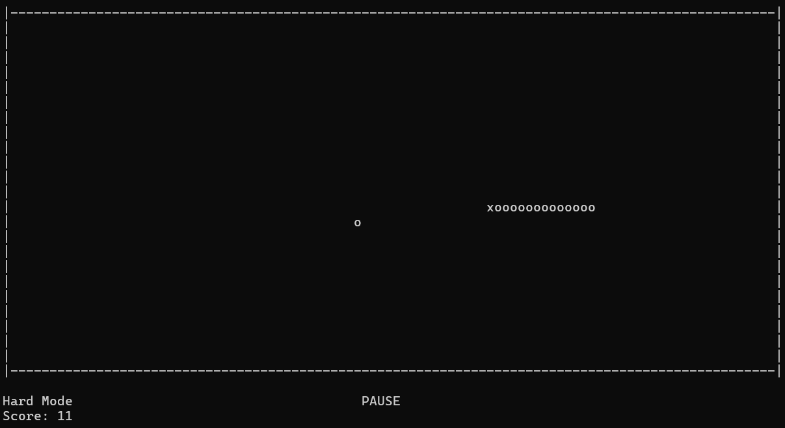

# 🐍 Snake Game (Console)

A classic Snake game built in **C#** to be played directly in the terminal/console.

Control the snake, eat the food that spawns on the screen to grow, try to get the highest score possible and avoid colliding with walls or biting your own tail.

---

## 🕹️ Controls

Use the **Arrow Keys** (↑ → ↓ ←) to move the snake.

Press the **Spacebar** to pause the game.

Alternatively, you can also use the standard **WASD** keys for movement.

---

The game features **4 difficulty modes** that adjust the snake's speed. Players can also choose whether to play **with or without map obstacles**. 

> Select your preferred mode in the main menu before starting.

---

## 📸 Screenshot



---

## 🚀 How to Play

### Option 1: Download & Play (Recommended)
You don't need .NET installed to play:
1. Go to the [Releases](../../releases/latest) tab and download `snake.exe` or `snake-game-win-x64.zip`.
2. Extract the files (if downloaded as `.zip`) and double-click `snake.exe`.
3. **Important:** Maximize your terminal window (or ensure it is at least **100x30**) for the best experience.

---

### Option 2: Run from Source Code
#### Prerequisites
- [.NET 10.0 SDK](https://dotnet.microsoft.com/) (or .NET 8/9 with updated `.csproj`).
1. Get the code by downloading the ZIP or cloning the repository using the terminal.
2. Open the project folder in your terminal or IDE (such as VS Code) and run:
   ```bash
   dotnet run
