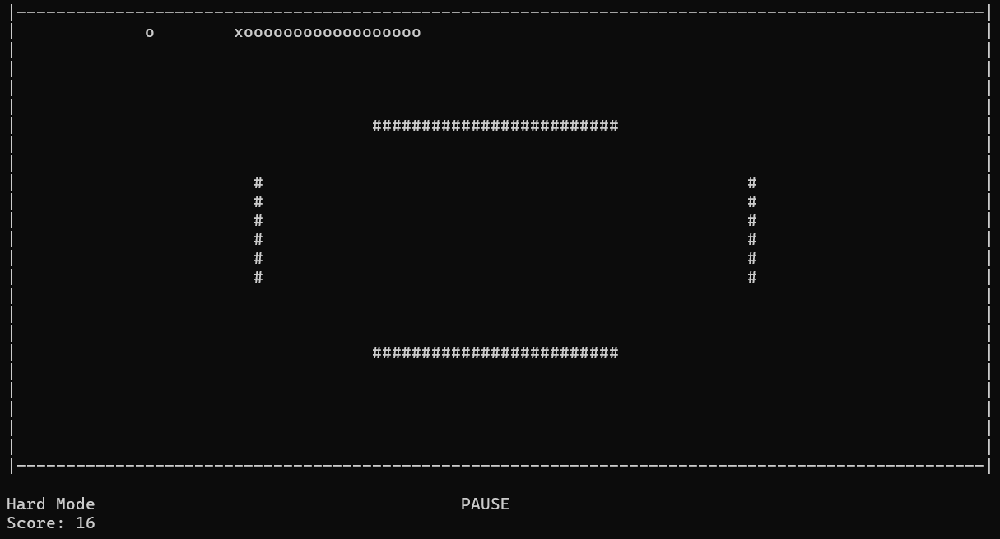

# 🐍 Snake Game (Console)

A classic Snake game built in **C#** to be played directly in the terminal/console.

Control the snake, eat the food that spawns on the screen to grow, try to get the highest score possible and avoid colliding with walls or biting your own tail.

---

## 🕹️ Controls

Use the **Arrow Keys** (↑ → ↓ ←) to move the snake.

Press the **Spacebar** to pause the game.

Alternatively, you can also use the standard **WASD** keys for movement.

---

The game features **4 difficulty modes** that adjust the snake's speed. Players can also choose whether to play **with or without map obstacles**. 

> Select your preferred mode in the main menu before starting.

---

## 📸 Screenshot


# With Obstacles


---

## 🚀 How to Run

### Prerequisites

- [.NET 10.0 SDK](https://dotnet.microsoft.com/) installed on your machine.

> *Compatibility note:* If you are using .NET 8 or 9, open the `.csproj` file and change `<TargetFramework>net10.0</TargetFramework>` to match your version.

1. Get the code by downloading the ZIP or cloning the repository using the terminal.
2. Open the project folder in your terminal or IDE (such as VS Code) and run:
   ```bash
   dotnet run
